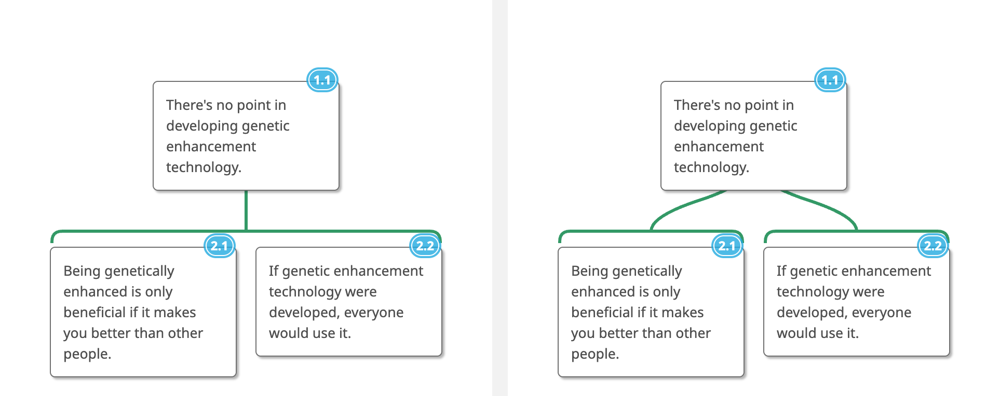

# ArgumentBase

A standalone editor and renderer for MindMup argument visualizations (`.mup`
files). MindMup discontinued free argument-visualization access in June 2026;
ArgumentBase runs the same MIT-licensed rendering engine
([mindmup/mapjs](https://github.com/mindmup/mapjs)) with the product's own
argument-mapping theme, so existing course maps open unchanged and render the
way they did in MindMup.


## Run it

No build step needed — the engine bundles are committed:

```
python3 -m http.server 8871      # from the repo root
open http://127.0.0.1:8871/app/
```

- Drag any `.mup` file onto the window to open it, or use File → Open.
- File → Save writes a standard `.mup` (JSON) that MindMup-family tools read.
- Work is autosaved to the browser's localStorage between sessions.

## Keyboard (the philmaps.com set)

| Key | Action |
|---|---|
| Enter | add reason under selected claim |
| Tab | add co-premise to selected claim |
| Alt+O | add objection |
| Alt+T | toggle reason/objection (on a bracket) or implicit/explicit (on a claim) |
| Alt+N | add sticky note |
| arrows | navigate; F2/Space edit; Delete remove; ⌘Z/⌘⇧Z undo/redo |
| Z / Shift+Z | zoom |

## The argument-visualization grammar

- Co-premises (claims that jointly make one reason) share **one bracket** with
  a single stem; independent reasons get **separate brackets** with fanning
  stems.
- Green brackets support; **red brackets are objections**.
- **Dashed borders** mark implicit claims; sticky notes are yellow handwriting
  notes; claim numbering (1.1, 2.1 …) is a view toggle.



## Fidelity

The theme is not a lookalike: it is the argument-mapping theme JSON extracted
from the embedded `theme` object of a `.mup` file saved by the MindMup product
(`app/js/themes.js`, `engine/theme-argmap.js`), plus the fonts MindMup used
(NotoSans for claims, Architects Daughter for stickies). Per-map embedded
themes, author-set node widths, connector-width overrides, links and
attachments in real `.mup` files are honored by the engine as-is. Known gaps:
CSS dashed borders draw slightly shorter dashes than MindMup's renderer, and
the `argMappingHighImpact` theme is reconstructed (base theme + "because…" /
"but…" connector labels) rather than extracted.

## Repo layout

```
app/           the editor (static ES modules; app/bundle.js is the engine)
engine/        vendored mapjs source + build script (see engine/README.md)
engine-demo/   raw engine playground (drag a .mup onto it; ?src=&labels=0)
samples/       synthetic .mup fixtures safe for a public repo
samples-local/ real course maps — gitignored, never commit
test/          app-e2e.js (Puppeteer smoke test), render-map.js (headless renders)
docs/          rendered proofs
```

Tests: `cd test && npm ci && node app-e2e.js` (expects the static server on
port 8871 and Google Chrome installed).
