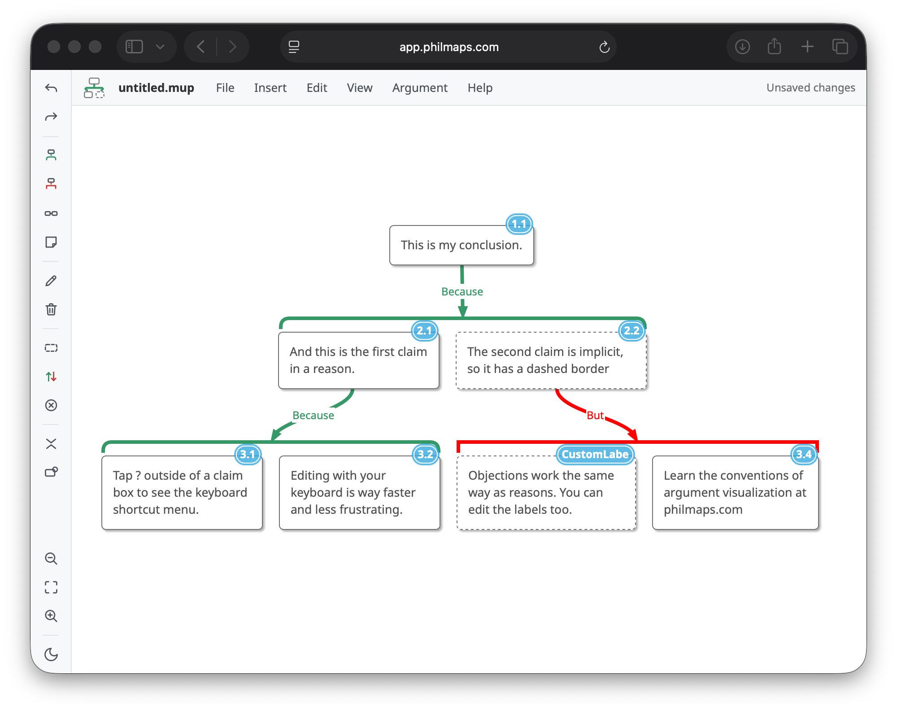

# Because

A standalone editor and renderer for MindMup argument visualizations (`.mup`
files). MindMup discontinued free argument-visualization access through Google
Drive in June 2026;
Because runs the same MIT-licensed rendering engine
([mindmup/mapjs](https://github.com/mindmup/mapjs)) with the product's own
argument-mapping theme, so existing course maps open unchanged and render the
way they did in MindMup. (Briefly named ArgumentBase — legacy infrastructure
IDs such as the Firebase site `argumentbase` keep the old name.)



## Run it

Hosted: **https://app.philmaps.com** (also at argumentbase.web.app, the
underlying Firebase site; deployed from this repo with
`./deploy.sh`). Locally, no build step is needed — the engine bundles are
committed:

```
python3 -m http.server 8871      # from the repo root
open http://127.0.0.1:8871/app/
```

- Drag any `.mup` file onto the window to open it, or use File → Open.
- File → Save writes a standard `.mup` (JSON) that MindMup-family tools read.
- Google Drive open/save is built in (`drive.file` scope, Picker-based);
  enabling it on a deployment takes one OAuth client — see
  [docs/drive-setup.md](docs/drive-setup.md).
- Microsoft OneDrive open/save is built in too (Graph `Files.ReadWrite`,
  PKCE popup auth, in-app picker); enabling it takes one Entra app
  registration — see [docs/onedrive-setup.md](docs/onedrive-setup.md).
- Work is autosaved to the browser's localStorage as crash recovery; the
  status text tracks whether the map is saved to its file.

## Keyboard (the philmaps.com set)

Press **?** in the map for the full reference, which renders its keys for
either platform (⌘/⌥ or Ctrl/Alt) and detects which one you are on. The keys
below are written Mac-first; on Windows and Linux read ⌘ as Ctrl and ⌥ as Alt.

| Key | Action |
|---|---|
| Enter | add reason under selected claim |
| Tab | add co-premise to selected claim |
| Alt+O | add objection |
| Alt+Q | add neutral connector — only while **View > Allow neutral connectors** is on |
| T (or Alt+T) | toggle reason/objection (on a bracket) or implicit/explicit (on a claim) |
| Alt+N | add sticky note |
| D | detach the selection — a claim, or a whole reason / objection — from the tree |
| L | label the connector above the selection |
| arrows | navigate; Shift+arrows select several claims at once |
| ⌘←/→ | reorder a claim among its co-premises |
| F2 / Space | edit; F collapses the branch; Delete removes the selection |
| ⌘Z / ⌘⇧Z | undo / redo (Ctrl+Y also redoes on Windows) |
| Z / Shift+Z | zoom |
| Shift+T | dark / light mode |
| Escape | leave the map — focus moves to the menus, since Tab inside the map adds a co-premise |
| ? | the keyboard reference |

`app/js/shortcut-help.js` holds the table the reference renders, and the
features e2e cross-checks it against `shortcuts.js`, so a binding added
without a line in the reference fails the suite.

## The argument-visualization grammar

- Co-premises (claims that jointly make one reason) share **one bracket** with
  a single stem; independent reasons get **separate brackets** with fanning
  stems.
- Green rounded brackets support; **red square brackets are objections**.
- **Blue flat brackets are neutral** — an uninterpreted connector that asserts
  no relation, so a question can carry the claims that answer it, or a claim
  the question it raises. Switch it on under **View > Allow neutral
  connectors**; it is off by default, and with it off there is no neutral tool
  in the toolbars and no Alt+Q. Maps that already use it always render it,
  whichever way the preference is set. The three bracket kinds differ in shape
  as well as colour.
- **Dashed borders** mark implicit claims; sticky notes are yellow handwriting
  notes; claim numbering (1.1, 2.1 …) is a view toggle. Click a number to put
  your own text there instead (up to 10 characters, stored per claim as
  `attr.claimLabel`); clearing it returns the claim to the computed number.

## Fidelity

The theme is not a lookalike: it is the argument-mapping theme JSON extracted
from the embedded `theme` object of a `.mup` file saved by the MindMup product
(`app/js/themes.js`, `engine/theme-argmap.js`), plus the fonts MindMup used
(NotoSans for claims, Architects Daughter for stickies). Per-map embedded
themes, author-set node widths, connector-width overrides, links and
attachments in real `.mup` files are honored by the engine as-is. Known gaps:
CSS dashed borders draw slightly shorter dashes than MindMup's renderer, and
the `argMappingHighImpact` theme is reconstructed (base theme + "because…" /
"but…" connector labels) rather than extracted.

## Repo layout

```
app/           the editor (static ES modules; app/bundle.js is the engine)
engine/        vendored mapjs source + build script (see engine/README.md)
engine-demo/   raw engine playground (drag a .mup onto it; ?src=&labels=0)
samples/       synthetic .mup fixtures safe for a public repo
samples-local/ real course maps — gitignored, never commit
site/          the landing page and its root-level pages (/privacy, /terms)
figures/       the landing page's argument-map figures: source maps + renderer
test/          eight e2e suites (Chrome + real WebKit) and render-map.js (headless renders)
docs/          rendered proofs
```

The maps on the landing page are live argument maps in the editor's own grammar,
pre-rendered from `figures/maps/*.json` and committed — including the `.mup` each
figure offers for download and hands to the editor. Edit the JSON, rerun
`node figures/build.mjs`: see [docs/figures.md](docs/figures.md).

Tests: `cd test && npm ci`, then `npm test`. The runner serves the repo root
and runs all nine suites in order: the Chrome ones via puppeteer-core
(`app-e2e.js`, `robustness-e2e.js` — blocked storage and unreadable files,
`click-select-e2e.js`, `drive-e2e.js`, `onedrive-e2e.js`, `features-e2e.js`),
then `webkit-e2e.js` (Playwright WebKit, the Safari-engine check),
`a11y-e2e.js` (WCAG 2.2 AA gate: axe-core scans plus the keyboard model, also
WebKit — see docs/accessibility.md) and `site-e2e.js` (the landing page's
figures, both engines). `npm test -- app-e2e.js` runs only the suites named.
It needs a system Chrome (or `CHROME_PATH` pointing at one) and Playwright
WebKit (`npx playwright-core install webkit`). All nine must pass before
deploying.

## License

MIT — see [LICENSE](LICENSE). Copyright (c) 2026 Simon Cullen.

The vendored rendering engine ([mindmup/mapjs](https://github.com/mindmup/mapjs))
and everything compiled into `app/bundle.js` are MIT too; the two bundled fonts
are under the SIL Open Font License 1.1. Their notices are collected in
[THIRD-PARTY-NOTICES.md](THIRD-PARTY-NOTICES.md), with the font license text
next to the fonts in `app/fonts/OFL.txt`.
